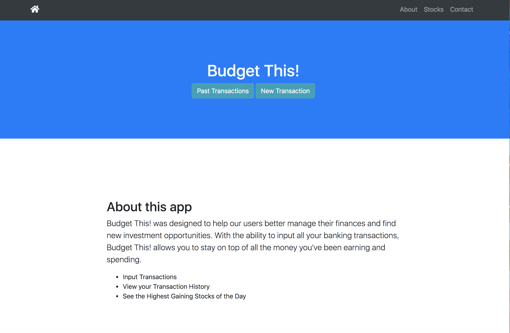
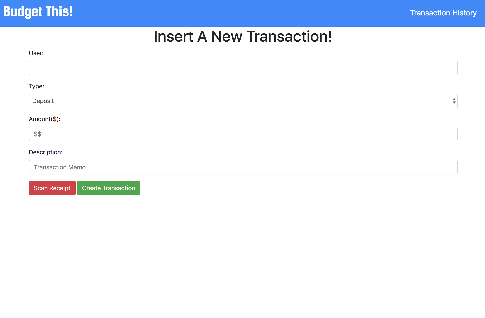
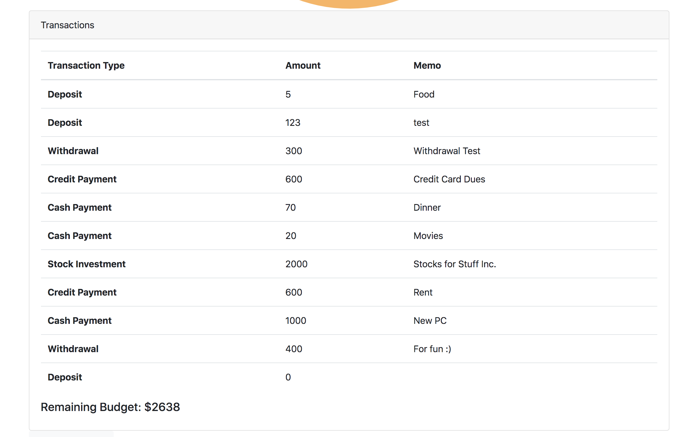
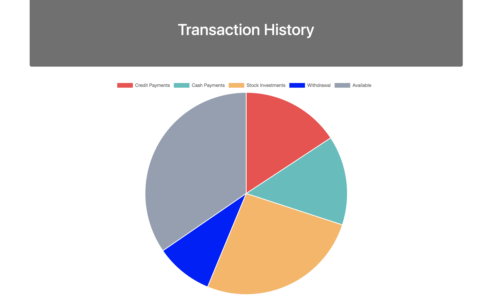

# Project2
Group Project 2

Deployed Heroku Link: http://budgetapp-1932.herokuapp.com/

DEVELOPERS: LAURA NEFF, ALEX STEINBERG, HARRISON NGAN

Info: A bugeting app that helps users log their expenses and income to help organize their budget, learn about new investment opportunities, and to
learn to spend money better and how much they spend per month on average. 

Technologies Used: Chai and Mocha for testing, Financial Modeling Prep API, Animation AOS Library, MySQL, Sequelize, Express, Bootstrap, Handlebars, etc.

Target Markets: The individual who wants to learn how to budget their money better, but does not know how. Looking to expand interface and app to make more adaptable/useful for accountants/financial advisors in future development.

